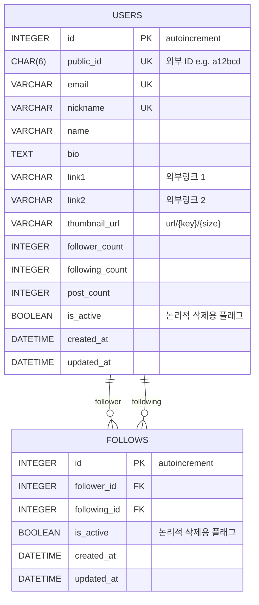

# Celebe-Challenge
Celebe 백엔드 개발자 채용 사전 과제 제출 프로젝트입니다. (제출자: 김상우)

# ERD

# 이슈 정리
### 1. 운영중인 앱을 참고했습니다.
- bio, link1, link2, follower_count, following_count, post_count 등의 컬럼을 추가했습니다.

### 2. 5개의 API 엔드포인트를 지원합니다. (#9, #13, #18)
- 프로필 조회: GET, /api/profiles/{publicId}
- 팔로우: POST, /api/profiles/{publicId}/follow
- 언팔로우: DELETE, /api/profiles/{publicId}/follow
- 팔로잉 목록 조회: GET, /api/profiles/{publicId}/followings
- 팔로워 목록 조회: GET, /api/profiles/{publicId}/followers
- Swagger에서 더 자세한 내용을 살펴보실 수 있습니다. 진입점은 `/swagger-ui.html` 또는 `/swagger-ui/index.html` 입니다.

### 3. 응답과 예외처리는 공통 규격이 있습니다. (#4, #9)
- [GlobalExceptionHandler](src/main/java/io/celebe/challenge/common/handler/GlobalExceptionHandler.java)는 `@RestControllerAdvice`로 공통 응답을 랩핑합니다.
- [CelebeApiResponse](src/main/java/io/celebe/challenge/common/response/CelebeApiResponse.java)는 성공 응답을, [ErrorResponse](src/main/java/io/celebe/challenge/common/response/ErrorResponse.java)는 실패 응답을 처리합니다.
- 비즈니스 예외 처리를 위한 [CelebeApiException](src/main/java/io/celebe/challenge/common/exception/CelebeApiException.java)과 에러 메세지의 상수 집합인 [ErrorMessage](src/main/java/io/celebe/challenge/common/constant/ErrorMessage.java)도 있습니다.

### 4. 테스트 코드를 지원합니다. (#14, #16, #21)
- 프로젝트 환경설정이 바뀌거나 리팩토링 시 단위 기능의 동작을 보장하기 위함입니다.
- /src/test/... 하위에 API별 테스트 코드가 있습니다. test 패키지 하위의 전체 테스트 실행도 가능합니다.

### 5. 멀티 프로파일 환경을 지원합니다. (#25)
- local, test, dev로 나뉩니다.
- [local](src/main/resources/application.yml)은 스키마가 사전 정의된 `celebe-local.db`를 생성해 사용합니다. Swagger 또한 이 db를 이용해 구동됩니다.
- [test](src/test/resources/application-test.yml)는 테스트 코드 실행용으로 인메모리 db를 사용합니다.
- [dev](src/main/resources/config/application-dev.yml)는 뼈대만 구현돼 있습니다. 실제 작동하지는 않습니다.

### 6. 로깅을 지원합니다. (#26)
- mybatis, jdbc, transaction는 debug 레벨 콘솔 로깅됩니다.
- 프로파일별 콘솔/파일 로깅을 지원하려 했으나 시간 부족으로 구현하지 못했습니다.

### 7. 일부 구상했으나 구현되지 않은 기능들이 있습니다.
- (#8) 실제 앱처럼 고유 식별값(publicId, 6자리)을 생성하고 검증하는 테스트 코드가 있으나 요구사항에 벗어난 것 같아 기술하지 않았습니다.
- (#10) 프로필 팔로우와 언팔로우에 따라 follower_count, following_count를 lazy하게 update하려고 구상했으나 시간 부족으로 구현하지 못했습니다.
- (#20) 목록 조회 방법을 여러가지로 구상해 성능을 비교해 보고 싶었으나 시간 부족으로 조사하지 못했습니다.

# 사족
꼭 일해보고 싶은 회사입니다 잘 부탁드립니다!
