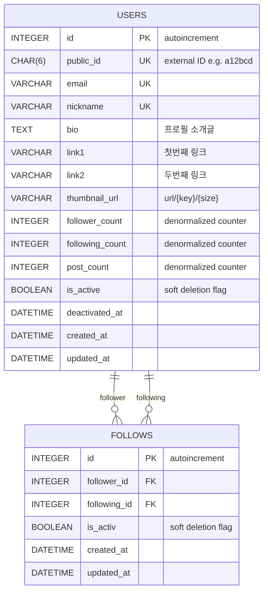

# Celebe-Challenge
Celebe 백엔드 개발자 채용 사전 과제 제출 프로젝트입니다. (제출자: 김상우)

# ERD

# API 명세

## 프로필 조회
- **URL**: `/api/profiles/{id}`
- **Method**: `GET`

## 프로필 팔로우
- **URL**: `/api/profiles/{id}/follow`
- **Method**: `POST`

## 프로필 언팔로우
- **URL**: `/api/profiles/{id}/follow`
- **Method**: `DELETE`

## 팔로워 목록 조회
- **URL**: `/api/profiles/{id}/followers`
- **Method**: `GET`

## 팔로잉 목록 조회
- **URL**: `/api/profiles/{id}/following`
- **Method**: `GET`
